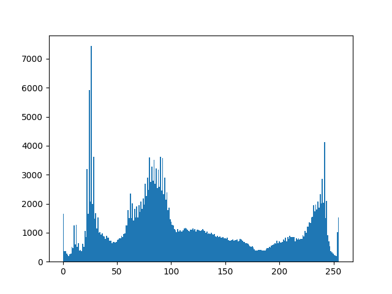
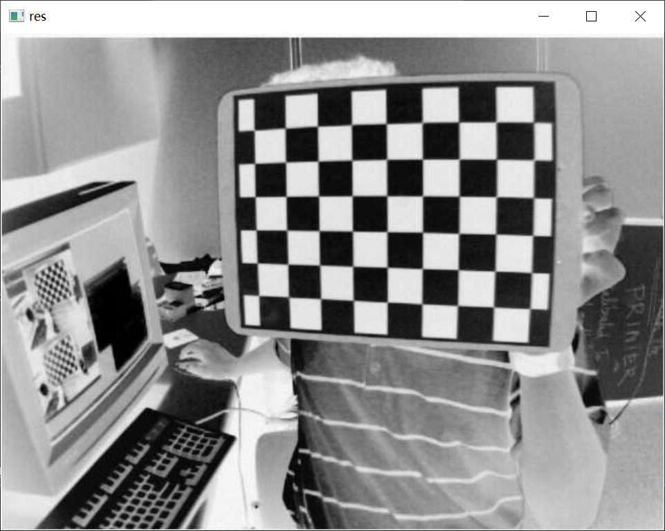
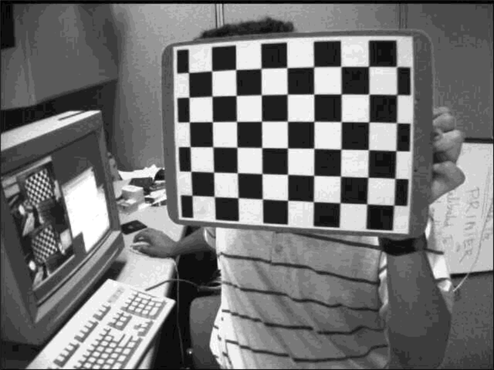
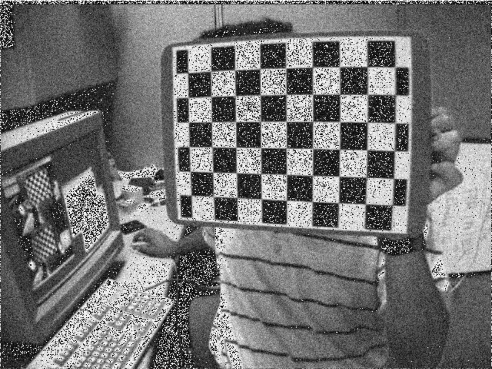
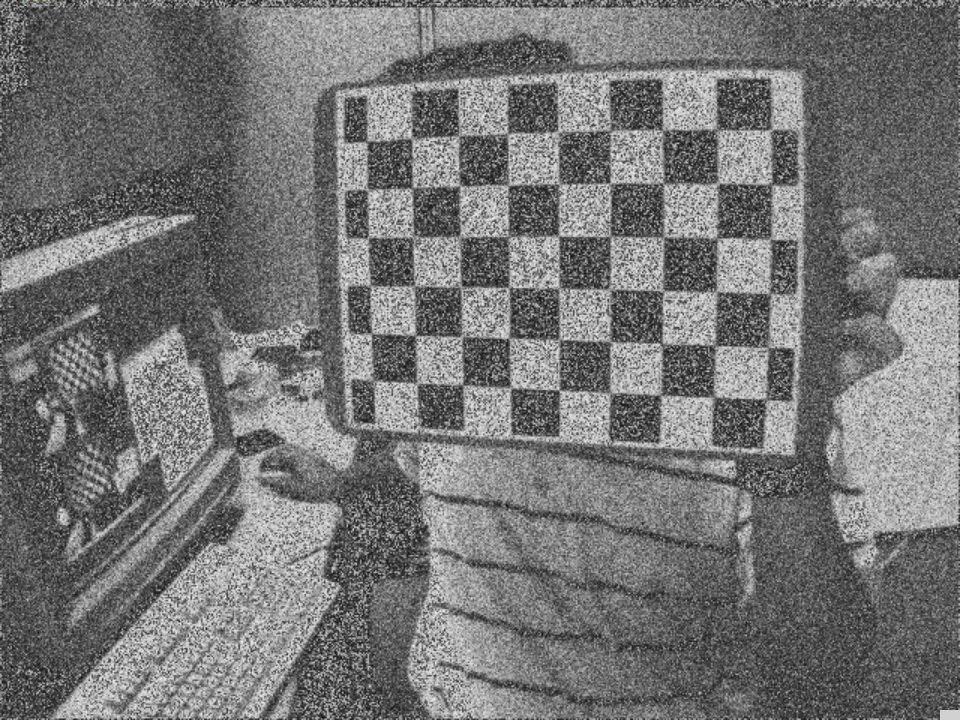
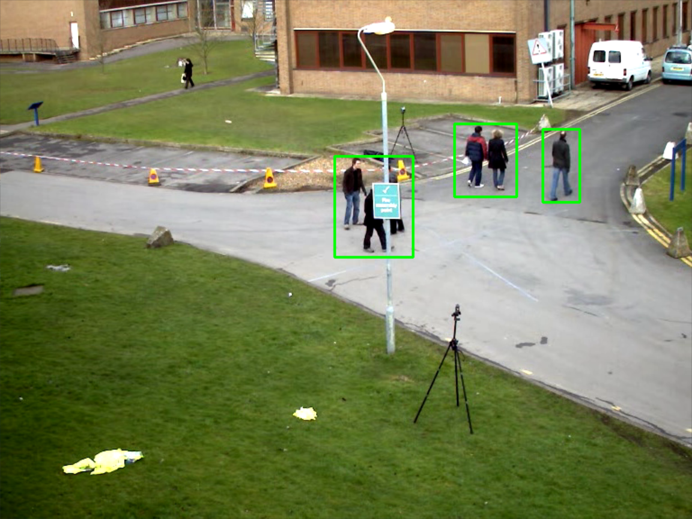
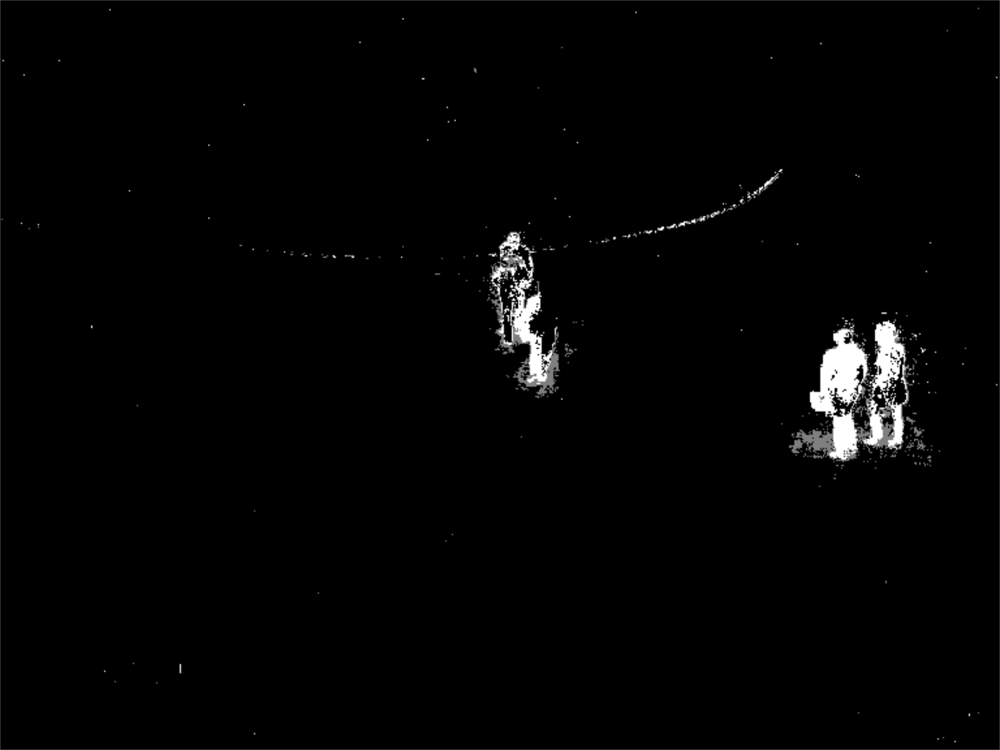
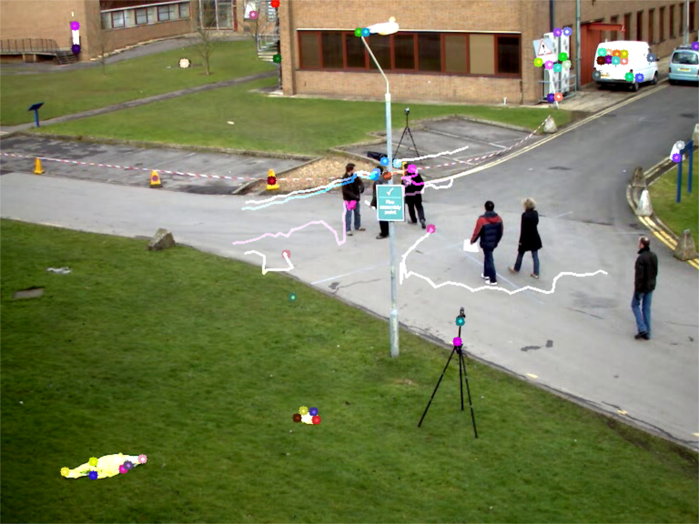

# Practice 1: 

## 实践内容： 

### (1)灰度图像的直方图计算和显示；

统计每一个灰度值出现的次数

实现方法：

```python


import matplotlib

def zft(img, draw=False):
    """
    直方图数据计算 和绘制直方图
    """
    d2 = {}
    for i in range(len(img)):
        for j in range(len(img[0])):
            if d2.get(str(img[i][j])):
                d2[str(img[i][j])] += 1
            else:
                d2[str(img[i][j])] = 1
    if draw:
        from matplotlib import pyplot as plt

        matplotlib.use('Qt5Agg')
        # 显示直方图
        plt.hist(img.ravel(), 256)
        plt.show()
    return d2
```

测试：

```python
def test_f1(self):
    """
    灰度图像的直方图计算和显示
    :return:
    """
    import cv2
    from practice1.pic_ import IMGU

    img = cv2.imread('../opencv-samples-data/left01.jpg', cv2.IMREAD_GRAYSCALE)

    IMGU.zft(img, draw=True)
    cv2.imshow('img', img)
    cv2.waitKey()
```

原图：


直方图：


###  (2)灰度图像的负像，256级灰度像的16级灰度转换；

#### 负像

实现方法：

```python
import numpy as np
def covert_to_16(img):
    # 除以15进行四舍五入 取整
    for i in range(len(img)):
        for j in range(len(img[0])):
            img[i][j] = np.around(img[i][j] / 15) * 15
    return img
```

测试：

```python
def test_f2(self):
    # 灰度图像的负像，
    import cv2
    from practice1.pic_ import IMGU

    img = cv2.imread('../opencv-samples-data/left01.jpg', cv2.IMREAD_GRAYSCALE)
    a4 = IMGU.fx(img)
    cv2.imshow('res', a4)
    cv2.waitKey()
```

负相图：


#### 16级灰度转换

实现方法

```python
import numpy as np

def covert_to_16(img):
    # 除以15进行四舍五入 取整
    for i in range(len(img)):
        for j in range(len(img[0])):
            img[i][j] = np.around(img[i][j] / 15) * 15
    return img
```

测试

```python
import cv2
from practice1.pic_ import IMGU
def test_f3(self):
    # 灰度级转换
    img = cv2.imread('../practice1/imgs/img21.png', cv2.IMREAD_GRAYSCALE)
    a4 = IMGU.covert_to_16(img)
    cv2.imshow('res', a4)
    cv2.waitKey()
```

16级灰度图



### (3)灰度图像随机增加不同参数的高斯噪声（零均值），采用图像相加的方法进行去噪；

#### 增加不同参数的高斯噪声

实现方法：

```python
from copy import copy

def noise(img, sigma=5, N=10):
    import random
    """
    :param img: 原始图像，
    :param sigma: 随机数范围，可理解为强度
    :param N: 产生数据量（图片张数）
    :return: 多张施加噪声后的数据列表
    """
    mu = 0  # 均值0
    re = []
    for _s in range(N):
        _img = copy(img)
        for i in range(len(img)):
            for j in range(len(img[0])):
                img[i][j] += random.gauss(mu, sigma)
        re.append(_img)
    return re

```

测试：

```python
from practice1.pic_ import IMGU
import cv2
def test_f4(self):
    # 生成噪声图
    img = cv2.imread('../practice1/imgs/img21.png', cv2.IMREAD_GRAYSCALE)
    a4 = IMGU.noise(img, sigma=20)
    cv2.imshow('res', a4[1])
    cv2.waitKey()
```

一张施加噪声后的图



#### 对带有噪声的多张图像求均值

实现方法：

```python
import numpy as np

def mean(imgs):
    """
    :param imgs: 带有噪声的图像集合
    :return: 均值后的图像
    """
    q = np.array(imgs[0], dtype=int)
    # 取第一张图像进行加和
    # 转换数据类型，防止溢出

    for _i in range(1, len(imgs)):
        for i in range(len(q)):
            for j in range(len(q[0])):
                q[i][j] += imgs[_i][i][j]
    q = q // len(imgs)
    # 求均值（取整）
    img1 = np.array(q, dtype='uint8')
    # 重新转换成 uint8 灰度图像类型
    return img1
```

测试：

```python
import cv2
from practice1.pic_ import IMGU
def test_f5(self):
    # 图像相加去噪
    img = cv2.imread('../practice1/imgs/img21.png', cv2.IMREAD_GRAYSCALE)
    imgs = IMGU.noise(img, sigma=20)
    img = IMGU.mean(imgs)
    cv2.imshow('res', img)
    cv2.waitKey()
```

相加去噪后的图：




###  (4)视频采用帧差法检测运动目标；

帧间差分法，即将前后两帧图像的像素值做相减。在环境亮度变化不大的情况下，如果对影响素质相差很小，可以认为该物体是静止的，如果图像区域某处的像素值变化很大，则认为该变化是由于运动物体所导致的。


该方法也有优缺点，在负载的环境下，如运动缓慢，光照或者雨雪天气时，帧差法的检测效果并不是很好。另外，当运动物体一旦静止或者被物体遮挡时，帧差法及其改进算法容易丢失物体信息。此外，由于帧间差分法的前提是图像背景的不变性，如果背景运动，该方法就不合适了。对于这种情况，可先补偿由摄像机移动引起的背景的运动，之后再对图像进行差分的计算。我们可以用两种方法来消除背景的相对运动所构成的不良效果：一种是补偿闭环系统中的自反馈对得到的运动镜头参数；另一种是匹配背景图像中特征比较突出的区域，在背景偏移量得到之后再进行一定的弥补。与第一种方法相比较来说，第二种方法在本质上不依靠在跟踪算法中的回路参数，进一步来说，当背景图像中有显著的框架特征时可以有好的背景弥补效果被获取，并且配准精度较高。

```python
import cv2
class FrameDiff:

    def __init__(self, l1, l2):
        self.es = cv2.getStructuringElement(cv2.MORPH_ELLIPSE, (9, 4))
        self.l1 = l1
        self.l2 = l2

    def frame_diff(self):
        """
        Frame difference 帧差法

        两帧图像计算插值寻找边缘

        :return: 两个图像的差值
        """

        l1 = FrameDiff.__pre_tr(self.l1)
        l2 = FrameDiff.__pre_tr(self.l2)
        # 预处理

        diff = cv2.absdiff(l1, l2)
        diff = cv2.threshold(diff, 25, 255, cv2.THRESH_BINARY)[1]  # 二值化阈值处理
        diff = cv2.dilate(diff, self.es, iterations=2)  # 形态学膨胀

        # https://blog.csdn.net/drippingstone/article/details/116081434
        # code line: 33-36

        return diff

    @staticmethod
    def __pre_tr(ll):
        # 对帧进行预处理，先转灰度图，再进行高斯滤波。
        # 用高斯滤波进行模糊处理，进行处理的原因：每个输入的视频都会因自然震动、
        # 光照变化或者摄像头本身等原因而产生噪声。对噪声进行平滑是为了避免在运
        # 动和跟踪时将其检测出来。
        # https: // blog.csdn.net / qq_45832961 / article / details / 122351534
        ll = cv2.cvtColor(ll, cv2.COLOR_BGR2GRAY)
        # 彩色转灰度
        ll = cv2.GaussianBlur(ll, (3, 3), 1)
        # 高斯滤波
        return ll

    def rec_angl(self, diff):
        # 绘制矩形框
        # https://blog.csdn.net/drippingstone/article/details/116081434
        # code line: 33-36
        contours, hierarchy = cv2.findContours(diff.copy(), cv2.RETR_EXTERNAL,
                                               cv2.CHAIN_APPROX_SIMPLE)  # 该函数计算一幅图像中目标的轮廓
        for c in contours:
            if cv2.contourArea(c) < 1500:  # 对于矩形区域，只显示大于给定阈值的轮廓，所以一些微小的变化不会显示。对于光照不变和噪声低的摄像头可不设定轮廓最小尺寸的阈值
                continue
            (x, y, w, h) = cv2.boundingRect(c)  # 该函数计算矩形的边界框
            cv2.rectangle(self.l2, (x, y), (x + w, y + h), (0, 255, 0), 2)

        return self.l2
```

测试代码：

```python
def test_frames_diff(self):
    import cv2

    """
    测试帧差法
    """

    from practice1.vio_ import Video
    from practice1.vio_ import FrameDiff

    vid = Video(path='../opencv-samples-data/vtest.avi')

    print(len(vid.frames))

    l1 = vid.frames[106]
    l2 = vid.frames[107]

    op = FrameDiff(l1=l1, l2=l2)

    lt = op.frame_diff()
    rel = op.rec_angl(diff=lt)

    cv2.imshow('diff', rel)

    cv2.waitKey()
```

测试结果图：


class video :

```python
import cv2
        
class Video:

    def __init__(self, path):
        self.video = cv2.VideoCapture(path)  # 视频对象
        self.frames = self.__all_frames()  # 所有帧
        self.height, self.width, self.RGB3 = self.frames[0].shape  # 高度和宽度
        self.len = len(self.frames)  # 帧数

    def __all_frames(self):
        frames = []
        capture = self.video
        while True:
            ret, img = capture.read()  # img 就是一帧图片
            frames.append(img)
            if not ret:
                break  # 当获取完最后一帧就结束
        return frames
```


### (5)视频中采用背景差分法进行运动目标检测；

它的基本思想是将输入图像与背景模型进行比较，通过判定灰度等特征的变化，或用直方图等统计信息的变化来分割运动目标。首先建立好背景模型，存储背景图像。当当前帧与背景图像相减大于一定的阈值时，则判定该像素为前景目标；输入图像减去背景图像，T为阈值（差值）。经过阈值处理后，图像中0值对应的点即为背景图像，1值对应的点即为场景中运动的像素点。

该方法实现较为简单，且实时性好，在完整的背景图像时，能够较好的捕获物体。但是该方法鲁棒性较差，动态场景的变化对结果又很大的影响，比如：光照的变化，天气的变化，采集位置的移动等。

源码：

```python
# 来源： https://opencv.apachecn.org/#/docs/4.0.0/6.3-tutorial_py_bg_subtraction?id=backgroundsubtractormog2
import cv2 as cv

cap = cv.VideoCapture('../opencv-4.6.0/samples/data/vtest.avi')

fgbg = cv.createBackgroundSubtractorMOG2()

while (1):
    ret, frame = cap.read()

    fgmask = fgbg.apply(frame)

    cv.imshow('frame', fgmask)
    k = cv.waitKey(30) & 0xff
    if k == 27:
        break

cap.release()
cv.destroyAllWindows()
```

效果图:




### (6)视频中采用光流法进行运动目标检测

光流是基于像素点定义的，反映了在时间间隔dt内由于运动所造成的图像变化，光流场是通过二维图来表示物体点的三维运动的速度场。使用光流法可以将与运动模型相适应的像素区域求出，然后再对区域进行合并以形成运动的对象进行物体检测。
采用光流法能够将物体独立的检测出来，不需要摄像机提供其他信息，但是在大多数的情况下，光流法比较耗费时间、计算复杂性大，并且抗噪声的能力很差，只有在特殊的硬件支持下，才能够实现实时的检测，即光流法的时间开销很大，其实时性和实用性也较差。由于仅利用光流方法的人脸跟踪方法会造成速度误差积累，容易导致长序列跟踪失败。

源码：

```python
"""
来源：https://opencv.apachecn.org/#/docs/4.0.0/6.2-tutorial_py_lucas_kanade
"""
import cv2 as cv
import numpy as np

cap = cv.VideoCapture('../opencv-4.6.0/samples/data/vtest.avi')

# ShiTomasi 角点检测的参数
feature_params = dict(maxCorners=100,
                      qualityLevel=0.3,
                      minDistance=7,
                      blockSize=7)

# Lucas-Kanade 光流算法的参数
lk_params = dict(winSize=(15, 15),
                 maxLevel=2,
                 criteria=(cv.TERM_CRITERIA_EPS | cv.TERM_CRITERIA_COUNT, 10, 0.03))

# 创建一组随机颜色数
color = np.random.randint(0, 255, (100, 3))

# 取第一帧并寻找角点
ret, old_frame = cap.read()
old_gray = cv.cvtColor(old_frame, cv.COLOR_BGR2GRAY)
p0 = cv.goodFeaturesToTrack(old_gray, mask=None, **feature_params)

# 创建绘制轨迹用的遮罩图层
mask = np.zeros_like(old_frame)

while (1):
    ret, frame = cap.read()
    frame_gray = cv.cvtColor(frame, cv.COLOR_BGR2GRAY)

    # 计算光流
    p1, st, err = cv.calcOpticalFlowPyrLK(old_gray, frame_gray, p0, None, **lk_params)

    # 选取最佳始末点
    good_new = p1[st == 1]
    good_old = p0[st == 1]

    # 绘制轨迹
    for i, (new, old) in enumerate(zip(good_new, good_old)):
        a, b = new.ravel()
        c, d = old.ravel()
        a, b = int(a), int(b)
        c, d = int(c), int(d)

        mask = cv.line(mask, (a, b), (c, d), color[i].tolist(), 2)
        frame = cv.circle(frame, (a, b), 5, color[i].tolist(), -1)
    img = cv.add(frame, mask)

    cv.imshow('frame', img)
    k = cv.waitKey(30) & 0xff
    if k == 27:
        break

    # 更新选取帧与特征点
    old_gray = frame_gray.copy()
    p0 = good_new.reshape(-1, 1, 2)

cv.destroyAllWindows()
cap.release()
```

效果图：


