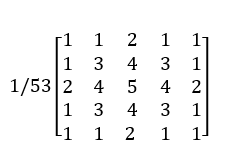
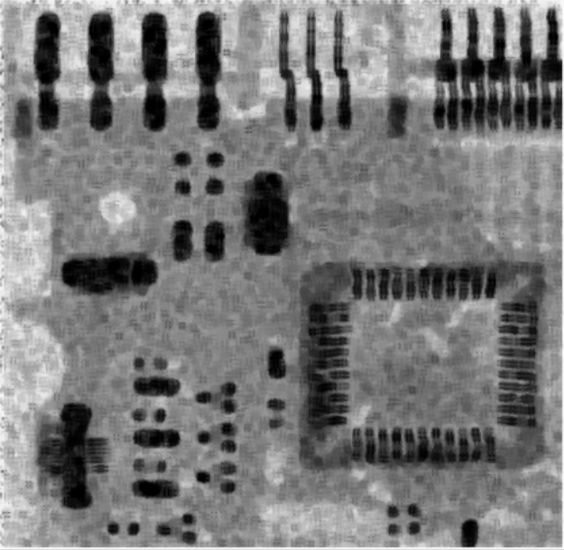

# Practice 2:

## 实践内容：

### 1. 灰度图像的直方图均衡化处理；

**实现代码：**

```python

from copy import deepcopy
import cv2
import matplotlib
from matplotlib import pyplot as plt
from numpy import histogram
matplotlib.use('Qt5Agg')

class ImgHiramEqa:
    def __init__(self, img):
        self.img = img
        self.fx = self.crete_fx()
    def crete_fx(self):
        points = self.img.ravel()
        ll = histogram(points, bins=[i for i in range(257)])[0]
        l2 = [None for _ in range(len(ll))]
        for i1, j1 in enumerate(ll):
            l2[i1] = sum(ll[:i1 + 1]) / len(points)
        fx = {}
        # 建立映射关系
        for index, j in enumerate(l2):
            fx[str(index)] = int(j * 255 + 0.5)
        return fx

    def cort_img(self):
        img2 = deepcopy(self.img)
        # 进行像素映射处理
        for key, val in self.fx.items():
            img2[img == int(key)] = val
        return img2
```

**测试样例**

```python

path = "../practice2/leuvenA_s.jpg"
img = cv2.imread(path, cv2.IMREAD_GRAYSCALE)
img2 = ImgHiramEqa(img=img).cort_img()
plt.hist(img.ravel(), 256)
plt.hist(img2.ravel(), 256)
cv2.imshow('img', img)
cv2.imshow('img2', img2)
plt.show()
```

**测试结果**

| 原                                                | 处理后的图                                                   |
| ------------------------------------------------- | ------------------------------------------------------------ |
|  |  |


直方图

> 蓝色为原始直方图，橘色为处理后的图像的直方图


### 2. 图像空域低通滤波；

低通滤波器在我们的日常生活中很有用，图像模糊，图像去噪以及图像识别都需要低通滤波器的处理。低通滤波即滤除图像中的高频部分（变化很快的部分），留下低频部分（变化不明显得到部分）。滤波器的实现有空域和频域两种：空域滤波器是直接在空间图像上进行操作，图像矩阵和滤波器算子进行卷积得到滤波后的输出；频域滤波器是将图像经过傅里叶变换到频域上再与滤波器做乘法得到输出。

常用的空域滤波器有平均滤波，中值滤波和高斯滤波。

### 3. 空域低通滤波消除噪声；

**中值滤波**

中值滤波，顾名思义，是一种基于统计方法的滤波器。具体的实现方法为：对于一个n*n的中值滤波器，输出图像的像素点(x,y)的像素值等于输入图像中以(x,y)为中心的n*n大小的图像区域中所有像素值的中位数。

滤波器的大小可以根据不同的需要进行选取。

中值滤波器得到的效果如下：

> 依次分别为原图像，3*3中值滤波，5*5中值滤波，7*7中值滤波。

| 原始图片 | 3*3中值 |
| -------------------------------------------- | ----------------------------------------- |
|                                              |                                           |

| 5*5中值 | 7*7中值 |
| ----------------------------------------- | ----------------------------------------- |
|                                           |                                           |

原图中有很多分布不规律的噪声，其中有一部分是盐噪声，但大部分是一些突然的脉冲噪声。在使用3*3的中值滤波时，盐噪声已经很好的去除掉了，但脉冲噪声依然很明显。使用5*5的中值时，脉冲噪声情况有了很大的改善。7*7的滤波器几乎完全去除了噪声，但图像的模糊也很严重。

高斯滤波

高斯滤波是一些图形处理软件中经常使用的模糊方法，由二维正态分布函数产生，具体做法如下：

- 若要产生n*n的高斯滤波器，将该n阶仿真的中心置为(0,0)，生成矩阵中其他位置的坐标；
- 将该n*n矩阵中的每个位置的坐标带入二维正态分布函数得到每个位置的数值；
- 以矩阵左上角置1为标准等比缩放矩阵中数值大小；
- 对矩阵进行取整得到的结果就是n*n的高斯滤波器

生成高斯滤波器的函数如下:

```py
import numpy as np
sigma=1.5   #高斯滤波器的参数
def f(x,y):     #定义二维正态分布函数
    return 1/(math.pi*sigma**2)*math.exp(-(x**2+y**2)/(2*sigma**2))

def gauss(n):   #生成n*n的高斯滤波器
    mid=n//2
    filt=np.zeros((n,n))
    for i in range(n):
        for j in range(n):
            filt[i][j]=f(i-mid,j-mid)/f(-mid,-mid)
    return filt.astype(np.uint8)
```

3*3，5*5，7*7的高斯滤波器如下：

|  |  |  |
| ------------------------------- | ------------------------------- | ------------------------------- |
|                                 |                                 |                                 |

其在二维坐标系中的图像如下：


|  |  |  |
| ------------------------------- | ------------------------------- | ------------------------------- |
|                                 |                                 |                                 |

在得到了高斯滤波器的算子之后，使用该算子与输入图像进行卷积即可得到高斯滤波器滤波后的结果。

其效果如下：

> 依次为原图，3*3，5*5，7*7高斯滤波的结果：

| 原始图片 | 3*3高斯 |
| ---------------------------- | -------------------------------------- |
|                              |                                        |

| 5*5高斯 | 7*7高斯 |
| -------------------------------------- | -------------------------------------- |
|                                        |                                        |

高斯模糊对于图像中的盐噪声去除效果较好，但对于脉冲噪声的去除显得颇为吃力，7*7的高斯滤波依然无法滤除掉图像中的脉冲噪声。另一方面，高斯模糊相较于终止模糊图像的信息保留较为完全，细节保留较多。

### 4. 空域高通滤波；

锐化处理的主要目的是突出灰度的过度部分，所以提取图像的边缘信息对图像的锐化来说非常重要。我们可以借助空间微分的定义来实现这一目的。定义图像的一阶微分的差分形式为


 从定义中就可以看出图像一阶微分的结果在图像灰度变化缓慢的区域数值较小，而在图像灰度变化剧烈的区域数值较大，所以这一运算在一定程度可以反应图像灰度的变化情况。

对图像的一阶微分结果再次微分可以得到图像的二阶微分形式


 二阶微分可以反应图像像素变化率的变化，所以对灰度均匀变化的区域没有影响，而对灰度骤然变化的区域反应效果明显。

由于数字图像的边缘常常存在类似的斜坡过度，所以一阶微分时产生较粗的边缘，而二阶微分则会产生以零分开的双边缘，所以在增强细节方面二阶微分要比一阶微分效果好得多。

**拉普拉斯算子**

最简单的实现二阶微分的方法就是拉普拉斯算子，仿照一维二阶微分，二维图像的拉普拉斯算子其定义为


将前面提到的微分形式带入可以得到离散化的算子


 其对应的拉普拉斯模板为


 对角线方向也可以加入拉普拉斯算子，加入后算子模板变为


 进行图像锐化时需要将拉普拉斯模板计算得的图像加到原图像当中，所以最终锐化公式为


 如果滤波器模板中心系数为负，则c值取负，反之亦然。这是因为当模板中心系数为负时，如果计算结果为正，则说明中间像素的灰度小于旁边像素的灰度，要想使中间像素更为突出，则需要则需要减小中间的像素值，即在原始图像中符号为正的计算结果。当计算结果为负时道理相同。

**非锐化掩蔽**

除了通过二阶微分的形式提取到图像边缘信息，也可以通过原图像减去一个图像的非锐化版本来提取边缘信息，这就是非锐化掩蔽的原理，其处理过程为

1. 将原图像进行模糊处理
2. 用原图像减去模糊图像得到非锐化版本
3. 将非锐化版本按照一定比例系数加到原图像中，得到锐化图像。

### 5. 图像的锐化处理；

**实现代码**

```python
import cv2
import numpy


class Laplace:
    m1 = [[0, -1, 0],
          [-1, 4, -1],
          [0, -1, 0]]
    m2 = [[-1, -1, -1],
          [-1, 8, -1],
          [-1, -1, -1]]


class ImgSharpen:

    def __init__(self, img: numpy.ndarray, mould: list):
        self.img = img
        self.mould = numpy.array(mould)
        self.Ishape = self.img.shape
        self.Mshape = self.mould.shape
        self.img_outline = self.filter()
        self.fil_tran_img = self.translation()
    def filter(self):
        """
        进行滤波操作
        :return:
        """
        _img_ = numpy.zeros(self.Ishape, dtype='uint8')
        for i in range(self.Ishape[0] - self.Mshape[0]):
            for j in range(self.Ishape[1] - self.Mshape[1]):
                m1 = self.img[i:i + self.Mshape[0], j: j + self.Mshape[1]]
                val = numpy.sum(m1 * self.mould)
                _img_[i + 1][j + 1] = 0 if val < 0 else val
        return _img_
    def translation(self):
        """
        进行灰度平移
        :return:
        """
        t_img = self.img + self.img_outline
        return numpy.array(t_img, dtype='uint8')
```

**测试样例**

```python
path = "../opencv-samples-data/lena.jpg"
img1 = cv2.imread(path, cv2.IMREAD_GRAYSCALE)
img2 = ImgSharpen(img=img1, mould=Laplace.m2)
cv2.imshow('img', img1)
cv2.imshow('img2', img2.img_u)
cv2.imshow('img3', img2.img_sharpen)
cv2.waitKey()
```

**测试结果**

| 原图                                                         | 轮廓                                                         | 锐化后的图                                                   |
| ------------------------------------------------------------ | ------------------------------------------------------------ | ------------------------------------------------------------ |
|  |  |  |

### 6. 椒盐噪声消除处理。

**实现代码**

```python
import cv2
import numpy
from numpy import median


class FilterMould:
    m1 = [[1, 1, 0, 1, 1],
          [1, 1, 0, 1, 1],
          [0, 0, 0, 0, 0],
          [1, 1, 0, 1, 1],
          [1, 1, 0, 1, 1]]

    m2 = [[0, 1, 1, 1, 0],
          [1, 0, 1, 0, 1],
          [1, 1, 0, 1, 1],
          [1, 0, 1, 0, 1],
          [0, 1, 1, 1, 0]]

    m3 = [[1, 0, 1, 0, 1],
          [0, 1, 1, 1, 0],
          [1, 1, 0, 1, 1],
          [0, 1, 1, 1, 0],
          [1, 1, 1, 1, 1]]


class FilterMethod:
    max_filter = 'max'
    min_filter = 'min'
    center_filter = 'center'
    medium_filter = 'medium'


class ImgFilter:

    def __init__(self, img: numpy.ndarray, mould, method: str):
        """
        
        :param img: 原始图像 
        :param mould: 滤波模板
        :param method: 滤波方式
        """

        self.img = img
        self.method = method
        self.mould = numpy.array(mould)
        self.shape_img = self.img.shape
        self.Mshape = self.mould.shape
        self.img_u = self.filter()

    def filter(self):
        """
        进行滤波操作
        :return:
        """
        _img_ = numpy.copy(self.img)
        r = (self.Mshape[0]) // 2 + 1
        m = self.Mshape[0]

        def medium_filter():
            for i in range(self.shape_img[0] - m):
                for j in range(self.shape_img[1] - m):
                    m1 = self.img[i:i + m, j: j + m]
                    _img_[i + r][j + r] = median(m1 * self.mould)

        def max_filter():
            for i in range(self.shape_img[0] - m):
                for j in range(self.shape_img[1] - m):
                    m1 = self.img[i:i + m, j: j + m]
                    _img_[i + r][j + r] = numpy.max(m1 * self.mould)

        def min_filter():
            for i in range(self.shape_img[0] - m):
                for j in range(self.shape_img[1] - m):
                    m1 = self.img[i:i + m, j: j + m]
                    _img_[i + r][j + r] = numpy.min(m1 * self.mould)

        def center_filter():
            for i in range(self.shape_img[0] - m):
                for j in range(self.shape_img[1] - m):
                    m1 = self.img[i:i + m, j: j + m]
                    val = numpy.min(m1 * self.mould) + numpy.min(m1 * self.mould)
                    _img_[i + r][j + r] = val // 2

        if self.method == 'max':
            max_filter()
        elif self.method == 'min':
            min_filter()
        elif self.method == 'center':
            center_filter()
        elif self.method == 'medium':
            medium_filter()
        else:
            medium_filter()
        return _img_
```

**测试样例**

```python
path = "../practice2/imgelpa.png"
img1 = cv2.imread(path, cv2.IMREAD_GRAYSCALE)
img2 = ImgFilter(img=img1,
                 mould=FilterMould.m1,
                 method=FilterMethod.medium_filter)
cv2.imshow('img', img1)
cv2.imshow('img2', img2.img_u)

cv2.waitKey()


```

**测试结果**

| 原图                                                         | 中值滤波后的图                                               |
| ------------------------------------------------------------ | ------------------------------------------------------------ |
|  |  |

